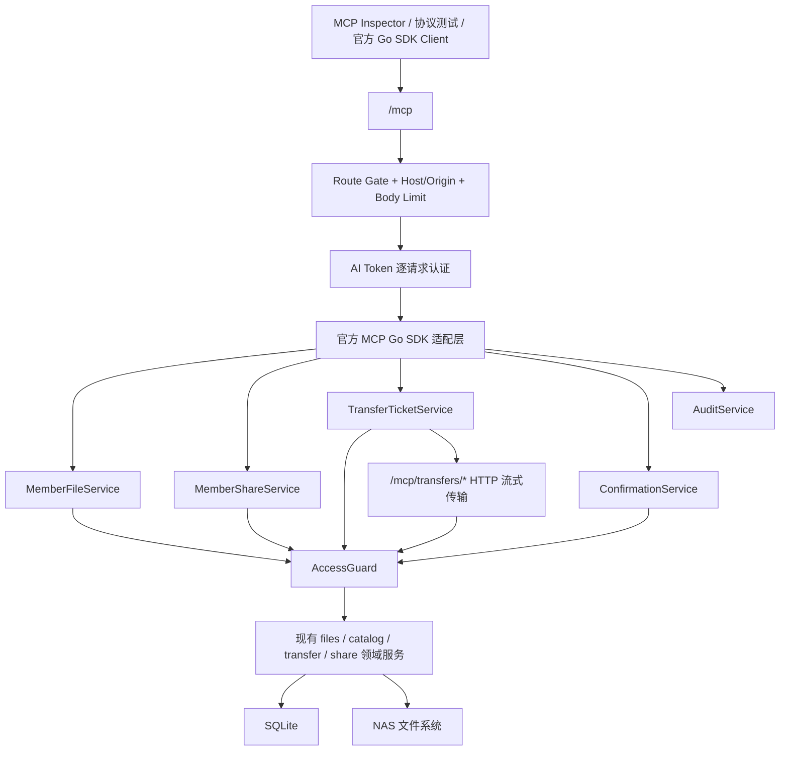

# 标准 MCP 完整文件管理设计

## 状态

- 日期：2026-08-06
- 状态：书面设计已确认，进入实施计划
- 协议主版本：MCP `2026-07-28`
- 实现方案：官方 Go SDK + 共享应用服务 + `/mcp` 直接切换

## 背景与现状

Omnora 的产品目标包含通过 API / MCP 让外部 AI 搜索、读取、上传和管理受控文件。当前仓库虽然暴露 `POST /mcp`，但它只接受 `{ "method": "...", "params": {} }`，并直接分派六个自定义方法。它没有标准 MCP 的协议发现、JSON-RPC、Tool schema、`tools/call`、Streamable HTTP、现代协议头或人工确认流程。

仓库已有准确说明当前局限的 `docs/mcp/README.md`，但前端仍把 MCP 描述为已经完成的 Streamable HTTP，并且 AI Token 页面没有端点、连接步骤、协议版本、Inspector 验证方法或能力限制。OpenAPI 当前只提供 YAML，完整帮助中心和交互式 API 文档属于后续文档子项目。

本设计优先解决标准 MCP 能力。目标不是包装现有私有协议，而是用官方 SDK 建立可由 MCP Inspector 和协议测试验证的标准服务，并覆盖成员域的完整文件管理。

## 已确认决策

1. `/mcp` 直接替换为标准 MCP Streamable HTTP，不保留 `{method, params}` 私有协议，也不增加 legacy 端点。
2. 主协议使用 MCP `2026-07-28` 无状态模型；同时验证官方 SDK 对 `2025-11-25` 的兼容协商。
3. 使用官方 `github.com/modelcontextprotocol/go-sdk` v1.7.0，固定依赖版本并补充许可证与 SBOM/NOTICE 信息。
4. 认证继续复用 Omnora AI Token，以预共享 Bearer Token 逐请求认证。本阶段不实现 OAuth 2.1，也不把 AI Token 宣称为标准 MCP OAuth Profile。
5. 首版覆盖成员域完整文件管理与分享，不暴露用户、空间 ACL、挂载注册、索引、路由组、备份等管理员控制面。
6. 每个高风险操作使用 MCP `2026-07-28` 的 MRTR `input_required` 请求人工确认；客户端无法完成可靠确认时失败关闭。
7. 上传和下载由 MCP 工具签发短时传输票据，文件字节通过普通 HTTP 流式传输，不在 MCP JSON 中传 Base64。
8. 验收以 MCP Inspector modern 模式、官方 Go SDK Client、原始 HTTP 协议负例和服务端端到端测试为准，不绑定特定桌面 AI 客户端。

## 目标

- MCP Inspector modern 模式能够连接 `/mcp`，发现服务器能力和当前 Token 可用工具，并调用完整成员文件工具。
- 读取、写入、上传、下载、重命名、复制、移动、回收站、永久删除和分享全部沿用同一套账号、ACL、Token scope、目录边界、挂载模式、挂载身份和对象状态检查。
- Token 撤销、账号停用、ACL 降级、空间停用、挂载只读或身份漂移后，下一次 MCP 或票据请求立即失效。
- 高风险调用必须展示准确影响并取得真实用户确认；参数篡改、对象变化、过期和并发重放均不能执行。
- 大文件传输支持 Range、分片、校验和、取消与恢复，且不覆盖已存在对象。
- REST 和 MCP 不复制业务规则；二者调用共享应用服务。
- 前端能够创建合适 scope 的 Token、复制 MCP 端点和 Inspector 配置，并准确说明 OAuth 尚未实现。

## 非目标

- 不提供用户、ACL、挂载、索引、路由组、备份或其他管理员 MCP 工具。
- 不实现 OAuth 2.1、Protected Resource Metadata、动态客户端注册或授权服务器发现。
- 不支持旧 `{method, params}` 私有协议。
- 不把文件正文以内联 Base64 方式上传到 MCP Tool。
- 不新增 stdio MCP 入口；Omnora 继续通过现有 HTTP 服务提供远程 MCP。
- 不在本阶段建设全局帮助中心、Swagger、ReDoc、Scalar 或补齐全部 OpenAPI operation/schema。
- 不新增 Prompt、Sampling、Roots、RAG、OCR、正文索引或模型内置分析能力。

## 总体架构



### HTTP 入口

- 标准 MCP endpoint：`/mcp`。
- 传输票据 endpoint：`/mcp/transfers/{publicId}` 及其分片子路径。
- MCP endpoint 由官方 SDK Handler 完整拥有，不再使用仅匹配 `POST /mcp` 的自定义 handler。
- 中间件顺序为：MCP 路由组 Gate → Host allowlist → Origin protection → 请求体上限 → AI Token Bearer 认证 → MCP SDK Handler。
- 传输端点使用同一 MCP 路由组 Gate，但验证 Transfer Ticket Bearer，而不是再次接收 AI Token 明文。
- 全局 request ID、访问日志、panic recovery 和安全响应头继续复用现有 Server wrapper。

### SDK 配置

- `StreamableHTTPOptions.Stateless = true`，启用 MCP `2026-07-28` 无状态请求。
- `PropagateRequestCancellation = true`，客户端取消时向应用服务传递 Context 取消。
- `JSONResponse = true`，当前工具均以有限时长的 JSON/MRTR 请求完成；文件字节不进入 SDK 响应。
- MCP 请求体硬限制为 1 MiB；文件内容只走传输端点。
- 不通过 `MCPGODEBUG` 长期恢复 session 或关闭安全保护。
- SDK 的 localhost protection 与项目 Host allowlist 一起验证；只有在明确的反向代理场景中，且严格 Host allowlist 已生效后，才允许关闭 SDK 重复的 localhost 检查。

## 组件职责

### MCP 适配层

物理包使用 `internal/mcpapi`，只负责：

- 创建官方 MCP Server 和 Streamable HTTP Handler。
- 注册 Tool 名称、描述、annotations、`inputSchema` 和 `outputSchema`。
- 从请求 Context 读取当前 AI Token Principal。
- 将 MCP 输入转换为共享应用服务命令。
- 将应用结果转换为 `structuredContent` 和简短 TextContent。
- 将协议错误、业务错误和 MRTR 结果映射到标准 MCP 响应。

该包不得直接查询 SQL、操作 NAS 文件、伪造 Cookie 或调用现有 HTTP Handler。

### AccessGuard

在现有 `internal/access` 能力上增加面向应用服务的统一检查入口。每次操作按以下顺序验证：

1. 账号仍为 active。
2. AI Token 未过期、未撤销且 secret 匹配。
3. Tool 所需 scope 存在。
4. 账号当前仍可访问目标空间，且权限满足 viewer / editor / manager 要求。
5. 空间与挂载仍 active，挂载属于目标空间。
6. 所有源/目标 locator 均在 Token boundary 内，且不能进入 `.omnora/` 保留命名空间。
7. 写操作要求 read-write 挂载。
8. 执行文件操作前重新验证 mount identity 和目标对象状态。

授权结论不按 MCP session 缓存。`tools/list` 可以按当前 Token 的 scope、协议版本和客户端确认能力过滤工具；动态 Server/Tool catalogue 的缓存键只能包含规范化 scope 集、协议版本和能力集，不能缓存账号的 ACL 结论。

### MemberFileService

新增共享成员文件应用服务，REST Handler 与 MCP Tool 共同调用。它负责组合 AccessGuard、现有 `internal/files`、`internal/catalog`、`internal/transfer`、审计和分享失效语义。

关键规则：

- 同挂载与跨挂载的复制/移动使用统一入口。
- 移动、重命名、删除后统一处理旧路径下分享的失效或更新，不再由单个 HTTP Handler 偶然决定。
- 外部挂载没有 Omnora 回收站；永久删除必须走高风险确认。
- Managed mount 默认软删除到回收站。
- 上传完成前再次检查权限、挂载身份、校验和与目标不存在，禁止竞态覆盖。

### MemberShareService

扩展成员分享应用能力，统一提供创建、列表和撤销：

- 创建要求当前账号具备 manager 权限，并校验路径、预览/下载能力、有效期、密码和次数限制。
- 列表仅返回调用者创建的分享，或调用者当前管理空间内的分享。
- 列表默认不返回既有分享 secret；只有新建响应返回完整分享 URL，且只展示一次。
- 撤销仅允许创建者或当前空间 manager 执行。

### ConfirmationService

高风险操作使用数据库支持的一次性确认挑战，而不是接受普通 `confirm: true`：

1. 首次 `tools/call` 完成只读预检，解析规范化参数、目标、影响数量和对象指纹。
2. 服务写入短时确认记录，并返回 MRTR `input_required`、面向用户的准确摘要和不可逆后果。
3. `requestState` 使用高熵 public ID + secret；数据库只保存 secret hash。
4. 确认记录绑定 Account ID、AI Token ID、Tool 名、规范化参数 hash、对象 identity/ETag、影响摘要和两分钟 TTL。
5. 用户同意后，客户端使用新 JSON-RPC ID、原始参数、`inputResponses` 和 `requestState` 重试。
6. 服务重新执行完整授权和对象预检，再以数据库条件更新原子占用确认记录。
7. 参数改变、对象改变、Token 改变、拒绝、超时、重复或并发重放全部失败；对象变化后必须重新生成确认。

MCP `2026-07-28` 客户端使用 MRTR。旧协议客户端若无法提供可靠人工确认，则 `tools/list` 不返回高风险工具，直接调用也返回 `client_capability_required`，绝不降级为布尔确认。

### TransferTicketService

Transfer Ticket 与 Confirmation 使用不同用途、不同记录和不同 secret：

- Ticket 绑定 Account ID、AI Token ID、操作类型、scope、空间、挂载、规范化路径、对象 identity/ETag、字节限制和过期时间。
- Ticket Bearer 使用 public ID + secret；数据库只保存 secret hash。
- Ticket secret 通过请求 Header 传递，不进入 URL、access log、审计或错误消息。
- 消费 Ticket 时按其 AI Token ID 重新查询 Token、账号、ACL、boundary、挂载和对象状态。AI Token 撤销或 ACL 降级立即使 Ticket 失效。

下载 Ticket 默认有效十分钟，不超过 AI Token 的剩余有效期。它支持一个对象的多个 Range 请求，因此不是首个 `206` 后立即销毁，而是在 TTL、对象版本和累计字节预算内复用。

上传 Ticket 默认有效三十分钟，不超过 AI Token 或上传会话有效期。它绑定唯一 upload session，可上传多个分片；完成或取消后立即失效。`uploads.complete` 仍通过 MCP Tool 执行最终校验和原子发布。

### AuditService

- 所有 MCP mutation、Ticket 签发/消费和高风险确认写入 `route_group=mcp`。
- 审计主体包含账号、AI Token public ID、Tool、目标标识、结果、request ID 和 trace ID。
- 不记录 Bearer、Transfer Ticket、Confirmation secret、密码、文件正文或分享 fragment secret。
- 高风险操作执行前必须先写入 operation intent；写入失败则不执行。
- 执行后追加 succeeded / failed 终态事件。若文件系统已变更而终态事件写入失败，写入权限受限的本地故障日志并将服务 readiness 标记为风险状态；不能声称跨 SQLite 与文件系统实现了不存在的原子事务。

## MCP 工具目录

Tool 名使用小写点分命名，符合 MCP Tool name 允许的字符范围。所有 Tool 都提供明确 input/output schema、结构化结果和风险 annotations。

| Tool | Scope | 风险 | 关键规则 |
| --- | --- | --- | --- |
| `spaces.list` | `spaces:read` | 只读 | 返回当前实时可见空间，不沿用旧实现中仅回显 Token boundaries 的行为 |
| `mounts.list` | `spaces:read` | 只读 | 只返回当前空间内、当前账号和 Token 可访问的挂载 |
| `files.list` | `files:list` | 只读 | 输入 locator，返回目录和分页信息 |
| `files.metadata` | `files:metadata` | 只读 | 返回对象类型、大小、修改时间、预览能力和 identity |
| `files.search` | `search:read` | 只读 | 仅搜索已索引且在授权 boundary 内的内容 |
| `files.read_text` | `files:text` | 只读 | 默认 64 KiB，硬上限 1 MiB，返回 truncated |
| `files.prepare_download` | `files:download_ticket` | 只读 | 返回短时下载 Ticket、URL、headers、size、ETag、expiresAt |
| `directories.create` | `files:write` | 变更 | editor+、read-write mount、目标不存在 |
| `files.prepare_upload` | `uploads:create` | 变更 | 创建 upload session 和短时分片 Ticket，禁止覆盖 |
| `uploads.status` | `uploads:create` | 只读 | 返回已上传分片、大小、过期时间和目标状态 |
| `uploads.complete` | `uploads:create` | 变更 | 重新验证权限、校验和、目标竞态并原子发布 |
| `uploads.cancel` | `uploads:create` | 变更 | 按 `uploadId` 取消当前 Token 拥有的一个 upload session，并使其 Ticket 失效 |
| `files.rename` | `files:write` | 变更 | 规范化目标名称并统一处理旧分享路径 |
| `files.copy` | `files:write` | 变更 | 源需 viewer+，目标需 editor+；源和目标均在 Token boundary 内 |
| `files.move` | `files:write` | 高风险确认 | 同挂载或跨挂载统一；移动完成后旧路径分享失效 |
| `files.trash` | `files:trash` | 高风险确认 | 仅 Managed mount；返回 trash ID 和原路径 |
| `trash.list` | `trash:read` | 只读 | 只列当前授权 Managed mount 的回收站 |
| `trash.restore` | `files:restore` | 变更 | 返回实际恢复路径；冲突时不覆盖 |
| `trash.purge` | `files:purge` | 高风险确认 | 永久删除一个回收站条目 |
| `trash.empty` | `files:purge` | 高风险确认 | 确认摘要必须展示条目数量和总大小 |
| `files.delete_permanently` | `files:purge` | 高风险确认 | External mount 或明确永久删除；展示规范化路径和对象 identity |
| `shares.list` | `shares:read` | 只读 | 不返回既有 secret |
| `shares.create` | `shares:create` | 高风险确认 | 展示目标、公开范围、有效期、预览/下载和次数限制 |
| `shares.revoke` | `shares:revoke` | 高风险确认 | 展示分享目标并明确链接不可恢复 |

### Scope 集合

保留现有读取和传输 scope：

- `spaces:read`
- `files:list`
- `files:metadata`
- `files:text`
- `files:download_ticket`
- `search:read`
- `uploads:create`

新增：

- `files:write`
- `files:trash`
- `trash:read`
- `files:restore`
- `files:purge`
- `shares:read`
- `shares:create`
- `shares:revoke`

Scope 只赋予调用资格，不替代动态 ACL、Token boundary、mount mode、mount identity 或 MRTR 确认。

### Tool schema 与结果

- locator 统一为 `{ "spaceId", "mountId", "path" }`，`path` 是挂载内规范化相对路径。
- Tool name、description、input/output schema 是稳定协议，字段命名使用 lowerCamelCase。
- `inputSchema` 和 `outputSchema` 使用 JSON Schema 2020-12。
- 成功结果同时返回 `structuredContent` 和短 TextContent 摘要；输出必须符合 `outputSchema`。
- annotations 明确 `readOnlyHint`、`destructiveHint`、`idempotentHint` 和 `openWorldHint`，但这些字段不参与服务端授权。
- `tools/list` 结果使用 private/per-user cache scope；不能跨不同 Token scope 共享工具列表。

## 协议和错误契约

### 协议版本

主发布门禁为 MCP `2026-07-28`：

- 无状态 Streamable HTTP。
- 支持 `server/discover`。
- 验证逐请求 `_meta`、`Mcp-Protocol-Version`、`Mcp-Method` 和 `Mcp-Name`。
- 支持 MRTR `input_required`。
- Inspector 必须显式使用 modern 模式，不能以 legacy 自动降级结果冒充通过。

兼容门禁为 `2025-11-25`：

- 使用官方 SDK 完成协议协商、initialize 和 Tool 生命周期测试。
- 只读和非高风险变更工具可用。
- 无可靠确认能力时，高风险工具不暴露且不能调用。

### 错误分层

入口和认证错误使用 HTTP 状态：

- `401`：AI Token 缺失、格式错误、伪造、过期、撤销或账号停用。
- `403`：非法 Origin/Host 或传输级授权拒绝。
- `404`：MCP 路由组关闭。
- `405`：不支持的 HTTP 方法。
- `413`：MCP 请求体超过 1 MiB。

协议错误使用 JSON-RPC 标准错误：

- `-32700` Parse error。
- `-32600` Invalid Request。
- `-32601` Method not found。
- `-32602` Invalid params / unknown Tool。
- `-32603` Internal error。

已经进入 Tool 但可由模型修正的业务错误通过 `isError: true` 返回：

```json
{
  "code": "readonly_mount",
  "message": "The target mount is read-only.",
  "requestId": "req_...",
  "retryable": false,
  "details": {
    "spaceId": "spc_...",
    "mountId": "mnt_..."
  }
}
```

稳定业务 code 至少包括 `forbidden`、`boundary_violation`、`readonly_mount`、`mount_identity_unverifiable`、`not_found`、`conflict`、`client_capability_required`、`confirmation_expired`、`confirmation_stale`、`ticket_expired` 和 `upload_conflict`。错误不得回显宿主机路径、Token、secret 或文件正文。

## 前端最小接入

### AI Token 页面

- 标题与说明改为“AI Token 与 MCP”，准确说明这是标准 MCP Wire Protocol + Omnora AI Token Bearer。
- 展示当前 MCP 路由状态、同源 `/mcp` endpoint、协议版本和“OAuth 尚未实现”。
- Token 创建提供四个权限预设：只读、文件管理、分享管理、永久删除。
- 永久删除默认关闭并独立展示高风险警告。
- 权限预设只控制 scope；页面明确说明高风险操作仍需逐次 MRTR 人工确认。
- 保留现有空间、挂载、目录 boundary 与有效期配置。

### 创建成功结果

Token 明文仍只展示一次，并同时展示：

- MCP endpoint。
- Inspector transport：Streamable HTTP。
- Protocol era：modern。
- `Authorization: Bearer <AI_TOKEN>` 配置。
- 一键复制连接信息。
- OAuth Profile 未实现的明确状态。

### 管理员路由组

- MCP 描述改为“标准 Streamable HTTP MCP，支持 2026-07-28，使用受限 AI Token”。
- 展示实际 `/mcp` URL 和复制按钮。
- 关闭后下一请求立即失败；不再展示错误的旧私有协议或目标能力文案。

## 文档与契约同步

本阶段必须同步：

- 重写 `docs/mcp/README.md`：协议版本、AI Token、24 个 Tool、scope、MRTR、Transfer Ticket、错误和 Inspector modern 验证。
- 更新 `docs/api/README.md`：说明 `/mcp` 不再是自定义 JSON envelope；记录传输端点与 AI Token/Ticket 认证边界。
- 更新 OpenAPI：移除旧 `/mcp` 自定义请求/响应 schema；新增纯 HTTP Transfer Ticket 端点契约；同步嵌入副本。
- 更新根 README 与文档地图的 MCP 状态和入口。
- 更新安全模型、领域模型、产品需求和验收标准中 MCP、AI Token、高风险确认与传输票据规则。
- 扩展 `verify-api-docs.sh` 或新增 MCP 协议校验脚本，检查 Tool 清单、scope、协议版本、嵌入契约与文档一致性。

第二阶段再建设全局帮助与集成中心、管理员/成员/分享完整操作手册、交互式 OpenAPI，以及 OpenAPI 占位 operation 和 schema 质量收口。

## 验证设计

### 共享应用服务单元测试

- AI Token 创建、hash、过期、撤销和账号停用。
- 所有新增 scope 的创建校验与权限预设映射。
- ACL viewer/editor/manager、Token boundary、相邻前缀、绝对路径、`..`、`.omnora/`、symlink 和 mount identity。
- 同挂载/跨挂载复制移动、分享失效、回收站、永久删除和目标冲突。
- Confirmation 同意、拒绝、超时、改参、对象变化、重复和并发重放。
- Ticket hash、TTL、字节预算、Range、分片、取消、完成、Token 撤销和 ACL 降级。
- MCP 审计脱敏、operation intent 和审计不可写时的失败关闭。

### MCP Adapter 合约测试

- 24 个 Tool 的 name、description、annotations、input/output schema 与 scope 过滤。
- `structuredContent` 符合 output schema，并带简短 TextContent。
- 所有业务错误映射为稳定 `isError` 结果。
- MRTR `input_required` 与 `requestState` 重试契约。
- 管理员 Tool 永不出现在 `tools/list`。

### 原始 HTTP 协议负例

- JSON parse、Invalid Request、method not found 和 invalid params。
- Header/body protocol version、method 和 name 不一致。
- 请求体上限、错误 Content-Type、非法 HTTP method。
- 合法/非法/`null`/畸形 Origin、Host allowlist 和反向代理头绕过。
- 缺失或无效 Bearer、Token 放 query、scope 不足。
- 并发 JSON-RPC ID、请求取消和 panic recovery。

### 官方 Go SDK 端到端

使用 in-process HTTP server 和真实 SQLite/临时文件系统：

- MCP `2026-07-28` `server/discover`、`tools/list`、`tools/call`。
- `2025-11-25` 兼容协商。
- 只读、上传下载、文件组织、回收站、永久删除和分享完整闭环。
- Token 撤销、账号停用、ACL 降级、挂载只读和身份漂移后的下一请求失败。
- MRTR 确认和 Confirmation 防重放。
- 下载 Range 与上传分片/完成。
- 路由组关闭、数据库持久化和环境覆盖优先级。

### MCP Inspector 发布 Smoke

- 固定 Inspector 版本。
- 显式选择 Streamable HTTP 和 modern protocol era。
- 使用测试 AI Token 连接部署 URL。
- 验证协议版本、Server identity、24 个 Tool 的 scope 子集、一个只读调用、一个普通写调用、一次 MRTR 高风险确认、一次下载 Ticket 和一次上传 Ticket。
- 不允许 Inspector 静默降级后仍判定发布通过。

### 发布状态

发布材料分别报告：

- `MCP Wire Protocol: PASS / FAIL`
- `Omnora AI Token Authorization: PASS / FAIL`
- `MCP OAuth Authorization Profile: NOT IMPLEMENTED`

不得使用一个笼统“支持 MCP”掩盖协议、预共享 Token 与 OAuth Profile 的差异。

## 失败处理与恢复

- Tool 业务失败不泄漏内部路径或敏感值，并返回可供模型修正的稳定 code。
- 跨挂载移动发生复制成功、源删除失败时，返回 `cross_mount_incomplete`，保留可定位结果并写审计，不宣称原子成功。
- 上传取消或过期清理临时分片；已完成对象不受取消影响。
- Confirmation 或 Ticket 过期时不自动续期；调用方必须重新预检或重新签发。
- SDK Handler panic 由现有 recover middleware 捕获；返回通用 internal error 并保留 request ID。
- 高风险 operation intent 写入失败时不执行；终态审计失败时进入 readiness 风险状态并写本地故障日志。

## 安全注意事项

- 所有远程部署通过 HTTPS；反向代理不得记录 Authorization Header、Ticket 或 Confirmation secret。
- Origin 校验用于防止浏览器/DNS rebinding，Host allowlist 用于约束代理与主机名，两者不能互相替代。
- Tool annotations 是提示，不是授权或确认机制。
- Transfer Ticket、Confirmation 和 AI Token 使用独立格式、独立 hash 记录和独立用途。
- `tools/list` 按 scope 过滤只减少不必要暴露，不替代 Tool 调用时的完整授权。
- 文件内容可能包含不可信指令；MCP 服务不执行文件内指令，也不因为内容赋予更高权限。

## 交付边界

本设计作为一个 MCP 优先子项目实施，交付包括：

1. 官方 SDK 与标准 `/mcp` transport。
2. 共享成员文件/分享应用服务和动态 AccessGuard。
3. 24 个 Tool 及新增 scope。
4. MRTR ConfirmationService。
5. TransferTicketService 与 HTTP 流式端点。
6. MCP 审计和错误契约。
7. AI Token / 路由组前端最小接入。
8. MCP、REST、OpenAPI、安全、需求与验收文档同步。
9. Inspector、官方 Go SDK 与协议负例发布门禁。

完整文档中心和交互式 OpenAPI 是下一个独立子项目，不在本设计中实现。

## 参考

- [MCP 2026-07-28 说明](https://blog.modelcontextprotocol.io/posts/2026-07-28/)
- [官方 MCP Go SDK](https://github.com/modelcontextprotocol/go-sdk)
- [MCP Inspector](https://modelcontextprotocol.io/docs/tools/inspector)
- [MCP Tool name 规范 SEP-986](https://modelcontextprotocol.io/seps/986-specify-format-for-tool-names)
- [MCP 2025-11-25 Authorization](https://modelcontextprotocol.io/specification/2025-11-25/basic/authorization)
